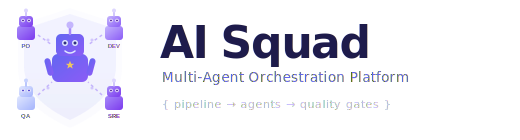

<p align="center">
  <picture>
    <source media="(prefers-color-scheme: dark)" srcset="docs/assets/logo-dark.svg">
    <source media="(prefers-color-scheme: light)" srcset="docs/assets/logo-light.svg">
    
  </picture>
</p>

<p align="center">
  <strong>Autonomous multi-agent orchestration platform with declarative pipelines</strong>
</p>

<p align="center">
  <a href="#quick-start">Quick Start</a> &bull;
  <a href="#features">Features</a> &bull;
  <a href="#presets">Presets</a> &bull;
  <a href="#configuration">Configuration</a> &bull;
  <a href="#architecture">Architecture</a> &bull;
  <a href="#development">Development</a> &bull;
  <a href="#leia-em-português">Português</a>
</p>

<p align="center">
  <a href="https://www.python.org/downloads/"></a>
  
  
  
  <a href="LICENSE"></a>
  
</p>

---

## What is AI Squad?

AI Squad is an **autonomous multi-agent orchestration platform** that coordinates specialized AI agents through **declarative YAML pipelines**. Define your workflow once — with steps, quality gates, and human checkpoints — and let the **Squad Lead** agent orchestrate everything.

```
You (Telegram/CLI)                    AI Squad
     │                                    │
     │  "Build auth API"                  │
     │───────────────────────────────────▶│
     │                                    │
     │                    ┌───────────────┴───────────────┐
     │                    │         Squad Lead            │
     │                    │   (reads pipeline, delegates) │
     │                    └───────┬───────────────────────┘
     │                            │
     │                    Pipeline: step-by-step
     │                    ┌───────▼───────┐
     │  📋 "Approve?"     │  Step 1: PO   │
     │◀──────────────────│  (checkpoint) │
     │  ✅ Approve        └───────┬───────┘
     │───────────────────────────▶│
     │                    ┌───────▼───────┐  ┌───────────────┐
     │                    │  Step 2: Dev  │──│  Dev Frontend  │
     │                    │  (parallel)   │  │  (background)  │
     │                    └───────┬───────┘  └───────┬───────┘
     │                            └────────┬─────────┘
     │                    ┌───────▼────────┐
     │  🔍 "Approve?"     │  Step 3: Review│
     │◀──────────────────│  (checkpoint)  │──▶ reject? → back to Step 2
     │  ✅ Approve        └───────┬────────┘
     │───────────────────────────▶│
     │                    ┌───────▼───────┐
     │  ✅ "Done!"        │  Step 4: QA   │
     │◀──────────────────└───────────────┘
```

**Think of it as CI/CD for AI agent workflows** — define your pipeline once, run it on any demand.

## Features

### Pipeline Engine
- **Declarative YAML pipelines** — define workflows as code, version-controlled and portable
- **Step types** — `agent` (auto-advance) or `checkpoint` (requires human approval)
- **Execution modes** — `subagent` (sequential), `background` (parallel), `inline`
- **Quality gates** — file checks, structural validation, and semantic review via LLM
- **Veto conditions** — auto-reject steps that fail predefined criteria
- **Review loops** — `on_reject` sends work back for revision with configurable max cycles
- **Model routing** — assign `fast` or `powerful` model tier per step

### Agent Orchestration
- **Hub-spoke coordination** — Squad Lead manages all agents centrally
- **Async background agents** — multiple agents running in parallel
- **MCP tools integration** — agents interact via structured tool calls
- **Heartbeat monitoring** — detects stalled agents, auto-retries with exponential backoff

### Intelligence Layer
- **Conversation memory** — auto-summarization when history exceeds 20 messages
- **Daily notes** — cross-session continuity (last 3 days injected in context)
- **Lessons learned** — FTS5 full-text search database for cross-demand learning
- **Decision journal** — traceable record of all Squad Lead decisions

### Messaging Channels
- **Telegram** — text, voice transcription (Whisper), photos, Markdown formatting
- **CLI** — stdin/stdout for local development and testing
- **Thread isolation** — Telegram Forum Topics for parallel demands

### Extensibility
- **Framework-agnostic** — the pipeline engine is independent of any AI provider
- **Plugin architecture** — add AI providers, messaging channels, or presets
- **Presets as templates** — ship reusable pipeline + agent configurations

## Quick Start

### Prerequisites

| Requirement | Purpose |
|-------------|---------|
| **Python 3.11+** | Runtime |
| **[uv](https://docs.astral.sh/uv/)** (recommended) or pip | Package manager |
| **Anthropic API key** | AI provider ([get one here](https://console.anthropic.com/)) |
| **Telegram Bot Token** | Messaging (optional — [create a bot](https://core.telegram.org/bots#how-do-i-create-a-new-bot)) |

### Installation

```bash
# Clone the repository
git clone https://github.com/tarcisiojr/ai-squad.git
cd ai-squad

# Option 1: Install globally with uv (recommended)
uv tool install --editable .

# Option 2: Install with pip in a virtualenv
python3.11 -m venv .venv
source .venv/bin/activate
pip install -e .
```

> **Note:** Editable mode (`-e`) means code changes take effect immediately — no need to reinstall unless you modify `pyproject.toml` dependencies.

### Create Your First Team

```bash
# Navigate to your project directory
cd ~/my-project

# Create a team (uses 'dev-openspec' preset by default)
ai-squad create MyTeam

# Configure environment variables
cat > .ai-squad/.env << 'EOF'
ANTHROPIC_API_KEY=sk-ant-...
TELEGRAM_BOT_TOKEN=123456:ABC-...
TELEGRAM_CHAT_ID=your-chat-id
EOF

# Start the team (foreground — Ctrl+C to stop)
ai-squad start MyTeam
```

Send a message to your Telegram bot and the Squad Lead will kick off the pipeline.

### CLI Mode (No Telegram Required)

For local development and quick testing without Telegram:

```bash
# Edit .ai-squad/config.yaml
# Change: messaging_provider: cli

ai-squad start MyTeam
# Type your demand directly in the terminal
```

## Presets

AI Squad ships with **3 production-ready presets**:

### `dev-openspec` — Software Development *(default)*

Full development lifecycle: specification, parallel implementation, code review with rejection loops, and QA.

| Step | Agent(s) | Type | Execution |
|------|----------|------|-----------|
| Specification | PO | `checkpoint` | sequential |
| Implementation | Dev Backend + Dev Frontend | `agent` | **parallel** |
| Code Review | Code Reviewer | `checkpoint` | sequential |
| QA | QA | `agent` | sequential |

```bash
ai-squad create MyTeam                     # default preset
ai-squad create MyTeam --preset dev-openspec  # explicit
```

### `infra-monitor` — Infrastructure Incident Response

Automated triage, remediation, and validation for infrastructure incidents.

| Step | Agent | Type | Model Tier |
|------|-------|------|------------|
| Triage | Triager | `agent` | `fast` |
| Remediation | SRE | `agent` | `powerful` |
| Validation | Validator | `agent` | `powerful` |

```bash
ai-squad create MyTeam --preset infra-monitor
```

### `investment-analysis` — Financial Analysis

Multi-agent research (parallel), thesis generation, and risk review.

| Step | Agent(s) | Type | Execution |
|------|----------|------|-----------|
| Research | Analyst + Quant + Macro | `agent` | **parallel** |
| Thesis | Strategist | `agent` | sequential |
| Risk Review | Risk Reviewer | `checkpoint` | sequential |

```bash
ai-squad create MyTeam --preset investment-analysis
```

## Configuration

### Directory Structure

Running `ai-squad create` generates a `.ai-squad/` directory inside your project:

```
my-project/
├── .ai-squad/
│   ├── .env                  # API keys and tokens
│   ├── config.yaml           # Team configuration
│   ├── pipeline/
│   │   ├── pipeline.yaml     # Workflow definition (source of truth)
│   │   └── steps/            # Step files (quality gates, veto conditions)
│   ├── agents/
│   │   └── <agent-id>/
│   │       └── AGENTS.md     # Agent role definition and instructions
│   └── state/                # Runtime state (auto-generated, gitignored)
└── your-project-files...
```

### config.yaml

```yaml
ai_provider: claude-agent-sdk
messaging_provider: telegram        # or 'cli'
ai_model: claude-sonnet-4-20250514

# Model routing by tier (optional)
light_model: claude-haiku-4-5-20251001    # used for 'fast' tier steps
heavy_model: claude-sonnet-4-20250514      # used for 'powerful' tier steps

agent_timeout: 300   # seconds, default per agent

squad_lead:
  name: "Squad Lead"
  avatar: "👨‍💼"

agents:
  po:
    name: "PO Agent"
    avatar: "📋"
    command: "/po"           # Telegram command to interact directly
  dev-backend:
    name: "Dev Backend"
    avatar: "⚙️"
    command: "/dev-back"
    timeout: 600             # override default timeout
```

### Environment Variables

| Variable | Required | Description |
|----------|----------|-------------|
| `ANTHROPIC_API_KEY` | Always | Anthropic API key for Claude |
| `TELEGRAM_BOT_TOKEN` | Telegram mode | Bot token from [@BotFather](https://t.me/BotFather) |
| `TELEGRAM_CHAT_ID` | Telegram mode | Target chat/group ID |

### pipeline.yaml

The pipeline is the **single source of truth** for the workflow. Step files (`.md`) contain only content (quality gates, veto conditions) — all configuration lives here:

```yaml
name: "My Pipeline"
description: "What this pipeline does"

pipeline:
  steps:
    - id: analysis
      name: "Analysis"
      agent: analyst
      type: agent              # auto-advance when done
      execution: subagent      # wait for completion
      model_tier: fast         # maps to light_model in config
      file: steps/step-01-analysis.md

    - id: implementation
      name: "Implementation"
      agents: [backend, frontend]   # multiple agents
      type: agent
      execution: background         # run in parallel
      model_tier: powerful           # maps to heavy_model in config
      file: steps/step-02-impl.md

    - id: review
      name: "Review"
      agent: reviewer
      type: checkpoint         # pauses for human approval
      execution: subagent
      model_tier: powerful
      on_reject: implementation  # loop back on rejection
      max_review_cycles: 3       # max retries before hard fail
      file: steps/step-03-review.md
```

## CLI Reference

### Team Management

```bash
ai-squad create <name>                     # Create team (local mode, default preset)
ai-squad create <name> --preset <preset>   # Use specific preset
ai-squad create <name> --repo <path>       # Docker mode (~/.ai-squad/teams/)

ai-squad start <name>                      # Start (auto-detects local or Docker)
ai-squad start <name> --local              # Force local mode
ai-squad start <name> --docker             # Force Docker mode
ai-squad stop <name>                       # Stop Docker container

ai-squad list                              # List all teams
ai-squad status <name>                     # Show active demands
ai-squad remove <name>                     # Remove team
ai-squad logs <name> [--tail N]            # View container logs
```

### Agent Management

```bash
ai-squad add-agent <team> <agent-id>       # Add agent to team
  --name "Agent Name"                      #   display name
  --avatar "🔧"                            #   emoji avatar
  --command "/cmd"                         #   Telegram command

ai-squad remove-agent <team> <agent-id>    # Remove agent
ai-squad list-agents <team>                # List agents and their config
```

### Docker

```bash
ai-squad build                             # Build/rebuild the Docker image
```

## Architecture

```
ai-squad/
├── src/
│   ├── models.py                # AgentStatus enum
│   ├── factory.py               # DI container (PlatformConfig + AgentConfig)
│   ├── daemon.py                # Main event loop: Telegram polling + heartbeat
│   ├── path_resolver.py         # Path resolution (local vs Docker)
│   ├── messaging/
│   │   ├── interface.py         # ABC: MessageBus
│   │   ├── cli.py               # CLI adapter (stdin/stdout)
│   │   └── telegram.py          # Telegram adapter (text, voice, photos)
│   ├── adapters/
│   │   ├── interface.py         # ABC: AIAgentAdapter (+ optional callbacks)
│   │   └── claude_agent_sdk.py  # Claude Agent SDK with MCP tools
│   ├── orchestrator/
│   │   ├── engine.py            # Squad Lead: hub-spoke coordination
│   │   ├── agent_runner.py      # Background agent lifecycle management
│   │   ├── pipeline.py          # YAML pipeline parser
│   │   ├── pipeline_state.py    # Pipeline state machine & executor
│   │   ├── prompt_builder.py    # Context assembly for agent prompts
│   │   ├── model_router.py      # Model selection by tier (fast/powerful)
│   │   ├── conversation.py      # Chat history + auto-summarization
│   │   ├── lessons.py           # FTS5 lessons learned database
│   │   ├── daily_notes.py       # Daily continuity notes
│   │   ├── journal.py           # Squad Lead decision journal
│   │   ├── media.py             # Image/file detection and sending
│   │   ├── state.py             # JSON state persistence
│   │   ├── context.py           # Workspace context collector
│   │   └── atomic_write.py      # Atomic file writes with fsync
│   ├── presets/                 # Pipeline templates
│   │   ├── dev-openspec/        #   Software development
│   │   ├── infra-monitor/       #   Infrastructure monitoring
│   │   └── investment-analysis/ #   Financial analysis
│   ├── cli/                     # Click-based CLI
│   └── whisper/                 # Audio transcription (Docker only)
├── tests/                       # 446 tests (75%+ coverage)
└── pyproject.toml               # Project metadata & tool config
```

### Design Decisions

| Decision | Rationale |
|----------|-----------|
| Declarative pipelines | Workflows as YAML, not imperative code — portable and versionable |
| ABC interfaces | Modules decoupled via abstract classes, not microservices overhead |
| Factory pattern | Single point that knows concrete implementations |
| Atomic writes with fsync | Prevents state/journal corruption on crash |
| Hub-spoke model | Squad Lead is the only agent that talks to humans |
| Model routing by tier | Pipeline defines complexity, config maps to concrete models |
| Auto-summarization | Context compressed after 20 messages to save tokens |
| Review loops | `on_reject` enables iterative improvement without human intervention |

### MCP Tools

These tools are available to agents via the [Model Context Protocol](https://modelcontextprotocol.io/):

| Tool | Description |
|------|-------------|
| `start_agent(name, task)` | Delegate work to a specific agent |
| `get_running_agents()` | Check status of background agents |
| `get_pipeline_state()` | Get current pipeline state |
| `advance_step()` | Manually advance pipeline step |
| `skip_step(step_id)` | Skip a step |
| `rerun_step(step_id)` | Re-execute a step |
| `check_artifacts(name)` | Validate change artifacts |
| `report_progress(msg)` | Send progress update to user |
| `send_image(path, caption)` | Send image via messaging channel |
| `learn_lesson(cat, prob, sol)` | Record lesson for future reference |
| `read_journal()` | Read decision history |
| `get_demand_state()` | Get active demand state |

## Development

### Setting Up the Dev Environment

```bash
# Clone the repository
git clone https://github.com/tarcisiojr/ai-squad.git
cd ai-squad

# Create virtual environment (Python 3.11+ required)
uv venv --python 3.11
# or: python3.11 -m venv .venv

# Activate
source .venv/bin/activate

# Install with dev dependencies
uv pip install -e ".[dev]"
# or: pip install -e ".[dev]"
```

### Running Tests

```bash
# Run full test suite (446 tests)
python -m pytest tests/ -v

# Run with coverage report
python -m pytest tests/ --cov=src --cov-report=term-missing

# Run specific test module
python -m pytest tests/test_engine.py -v

# Run tests matching a keyword
python -m pytest tests/ -k "pipeline" -v

# Quick run (no coverage)
python -m pytest tests/ --no-cov -q
```

### Code Quality

```bash
# Lint
ruff check src/

# Auto-fix lint issues
ruff check src/ --fix

# Format
ruff format src/

# Type checking
pyright src/
```

### Project Conventions

- **Code style**: enforced by [Ruff](https://docs.astral.sh/ruff/) (line length 100, Python 3.11 target)
- **Type checking**: [Pyright](https://github.com/microsoft/pyright) in basic mode
- **Test framework**: [pytest](https://docs.pytest.org/) with async support via `pytest-asyncio`
- **Coverage threshold**: 75% minimum (enforced in CI)
- **Imports**: sorted by Ruff isort with `src` as first-party

## Extending AI Squad

### Creating a Custom Preset

```bash
mkdir -p src/presets/my-preset/{pipeline/steps,agents}
```

1. Define `pipeline/pipeline.yaml` with your steps
2. Create step files in `pipeline/steps/` with quality gates
3. Create agent definitions in `agents/<agent-id>/AGENTS.md`
4. Use it: `ai-squad create MyTeam --preset my-preset`

### Adding a New AI Provider

Implement the `AIAgentAdapter` ABC:

```python
from src.adapters.interface import AIAgentAdapter
from src.models import AgentStatus

class MyAdapter(AIAgentAdapter):
    async def run(self, prompt: str, context: dict) -> str:
        # Call your AI provider
        ...

    async def ask(self, question: str) -> str:
        # Simple question-answer
        ...

    def status(self) -> AgentStatus:
        return self._status
```

Register in `factory.py`, then set `ai_provider: my-adapter` in config.

### Adding a New Messaging Channel

Implement the `MessageBus` ABC:

```python
from src.messaging.interface import MessageBus

class MyChannel(MessageBus):
    async def send_message(self, user_id: str, text: str, **kwargs):
        ...

    async def ask_user(self, user_id: str, question: str) -> str:
        ...

    async def send_approval_request(self, user_id: str, question: str, options: list) -> str:
        ...
```

Register in `factory.py`, then set `messaging_provider: my-channel` in config.

## Contributing

Contributions are welcome! Here's how to get started:

1. **Fork** the repository
2. **Create** a feature branch: `git checkout -b feature/my-feature`
3. **Write tests** for your changes
4. **Run the full suite**: `python -m pytest tests/ -v`
5. **Lint and format**: `ruff check src/ && ruff format src/`
6. **Submit** a pull request

Please follow existing code patterns and include tests for any new functionality.

## License

This project is licensed under the MIT License — see the [LICENSE](LICENSE) file for details.

---

<a id="leia-em-português"></a>

## 🇧🇷 Leia em Português

### O que é o AI Squad?

AI Squad é uma **plataforma de orquestração multi-agente autônoma** que coordena agentes de IA especializados através de **pipelines declarativos em YAML**. Defina seu workflow uma vez — com steps, quality gates e checkpoints humanos — e deixe o **Squad Lead** orquestrar tudo automaticamente.

**Pense como CI/CD para workflows de agentes IA** — defina o pipeline uma vez, execute em qualquer demanda.

### Início Rápido

```bash
# Clonar e instalar
git clone https://github.com/tarcisiojr/ai-squad.git
cd ai-squad
uv tool install --editable .

# Criar time no seu projeto
cd ~/meu-projeto
ai-squad create MeuTime

# Configurar variáveis de ambiente
cat > .ai-squad/.env << 'EOF'
ANTHROPIC_API_KEY=sk-ant-...
TELEGRAM_BOT_TOKEN=123456:ABC-...
TELEGRAM_CHAT_ID=seu-chat-id
EOF

# Iniciar o time (foreground — Ctrl+C para parar)
ai-squad start MeuTime
```

Envie uma mensagem ao bot no Telegram e o Squad Lead iniciará o pipeline.

### Funcionalidades Principais

| Categoria | Funcionalidades |
|-----------|----------------|
| **Pipeline** | YAML declarativo, steps auto/checkpoint, execução paralela, quality gates, loops de revisão, roteamento de modelo |
| **Orquestração** | Coordenação hub-spoke, agentes em background, MCP tools, heartbeat com retry |
| **Inteligência** | Sumarização automática, notas diárias, lições aprendidas (FTS5), journal de decisões |
| **Mensageria** | Telegram (texto, voz, fotos, Markdown), CLI, isolamento por threads |
| **Extensibilidade** | Framework-agnostic, providers plugáveis, presets como templates |

### Presets Disponíveis

| Preset | Descrição | Agentes |
|--------|-----------|---------|
| `dev-openspec` | Desenvolvimento de software | PO, Dev Backend, Dev Frontend, Code Review, QA |
| `infra-monitor` | Resposta a incidentes de infra | Triager, SRE, Validator |
| `investment-analysis` | Análise financeira | Analyst, Quant, Macro, Strategist, Risk Reviewer |

### Comandos

```bash
# Criação
ai-squad create MeuTime                    # modo local (.ai-squad/ no cwd)
ai-squad create MeuTime --preset <preset>  # preset específico
ai-squad create MeuTime --repo ~/app       # modo Docker

# Execução
ai-squad start MeuTime                     # auto-detecta modo
ai-squad stop MeuTime                      # para container Docker

# Gestão
ai-squad list                              # lista todos os times
ai-squad status MeuTime                    # demandas ativas
ai-squad remove MeuTime                    # remove time

# Agentes
ai-squad add-agent MeuTime sec             # adiciona agente
ai-squad remove-agent MeuTime sec          # remove agente
ai-squad list-agents MeuTime               # lista agentes
```

### Desenvolvimento

```bash
# Configurar ambiente
git clone https://github.com/tarcisiojr/ai-squad.git
cd ai-squad
uv venv --python 3.11
source .venv/bin/activate
uv pip install -e ".[dev]"

# Testes (446 testes, cobertura 75%+)
python -m pytest tests/ -v

# Qualidade de código
ruff check src/ && ruff format src/
pyright src/
```

### Documentação Completa

Para a documentação completa em inglês, veja as seções acima:

- [Quick Start](#quick-start) — Instalação e primeiro uso
- [Features](#features) — Todas as funcionalidades
- [Presets](#presets) — Pipelines pré-configurados
- [Configuration](#configuration) — Configuração detalhada (config.yaml, pipeline.yaml, .env)
- [Architecture](#architecture) — Estrutura do código e decisões de design
- [Development](#development) — Como configurar o ambiente e rodar testes
- [Extending AI Squad](#extending-ai-squad) — Como criar presets, providers e canais
